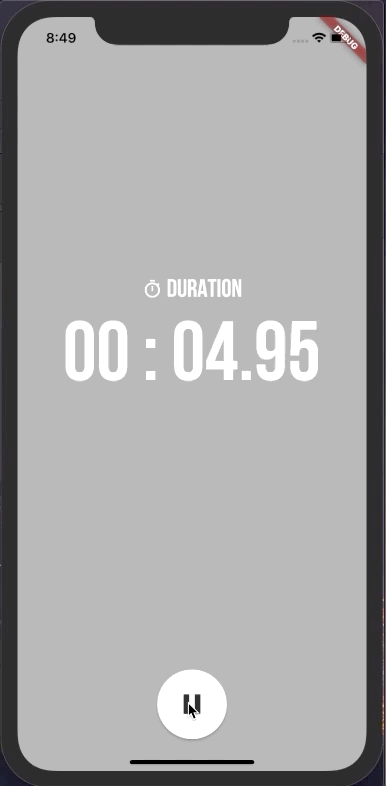

# flutter_stopwatch_bloc

Stopwatch application build in Flutter using bloc_pattern.

The buttons dynamically change according to the click event.

Also there is animation when resetting the stopwatch.

The basic codes of stopwatch referred to https://github.com/bizz84/stopwatch-flutter.

 

## Getting Started

This project is a starting point for a Flutter application.

A few resources to get you started if this is your first Flutter project:

- [Lab: Write your first Flutter app](https://flutter.io/docs/get-started/codelab)
- [Cookbook: Useful Flutter samples](https://flutter.io/docs/cookbook)

For help getting started with Flutter, view our 
[online documentation](https://flutter.io/docs), which offers tutorials, 
samples, guidance on mobile development, and a full API reference.
